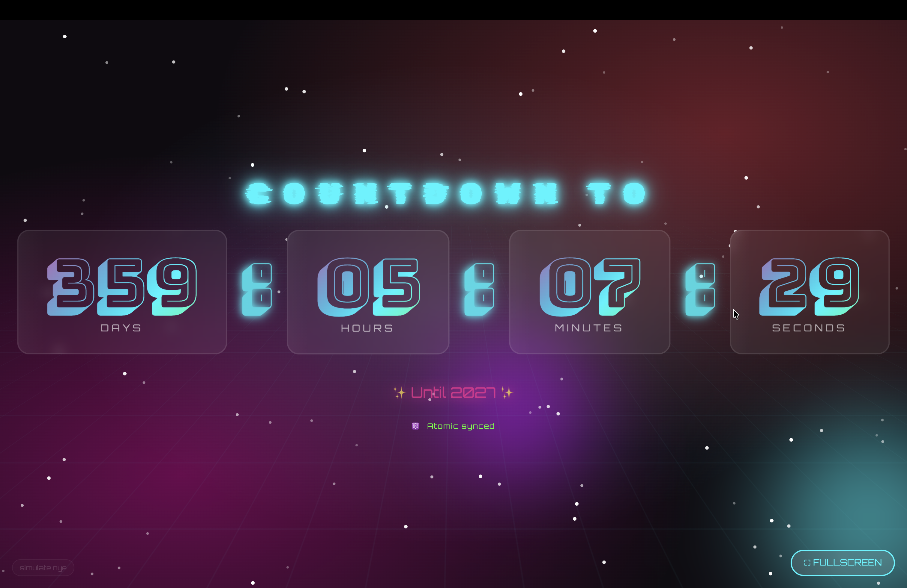

# NYE Countdown 🎆

A sleek New Year's Eve countdown with NTP-synchronized time accuracy. Because being off by even a second at midnight is unacceptable.

**Live Demo:** [nyecountdown.live](https://nyecountdown.live)



## What's This?

A real-time countdown to midnight that syncs with atomic clocks via NTP servers. The frontend calculates the exact offset between your device and the server, so everyone sees "0" at the same moment — no matter how wrong their system clock is.

Features:
- NTP-synced server time (pool.ntp.org, time.google.com, time.cloudflare.com)
- WebSocket ping/pong protocol for accurate client offset calculation
- Celebration mode with confetti, fireworks & emojis when the clock hits zero
- Simulation mode to test the celebration without waiting until December 31st
- Wake lock to keep your screen on during the countdown
- Fullscreen support

## Tech Stack

- **Frontend:** Angular 21 with Signals
- **Backend:** FastAPI + WebSockets
- **Time Sync:** ntplib (Python)
- **Deployment:** Docker, Caddy (auto-TLS)
- **Task Runner:** [just](https://github.com/casey/just)

## Quick Start

### Prerequisites

- [just](https://github.com/casey/just)
- [uv](https://github.com/astral-sh/uv)
- Node.js 20+
- Docker

### Local Development

```bash
# Install dependencies
just setup

# Terminal 1: Start backend
just backend

# Terminal 2: Start frontend
just frontend
```

Backend runs on `http://localhost:8000`, frontend on `http://localhost:4200`.

### Docker Development

```bash
just dev
```

This spins up everything with hot-reload via `docker-compose.dev.yml`.

## Deployment

The project is set up for deployment to any Docker host with Caddy as reverse proxy.

```bash
# Build and push images to Docker Hub
just push

# Deploy to server (requires NYE_SERVER env var)
NYE_SERVER=your.server.ip ./deploy.sh
```

The `deploy.sh` script copies `docker-compose.yml` and `Caddyfile` to the server and runs `docker compose up`.

## Project Structure

```
├── backend/           # FastAPI backend
│   ├── app/
│   │   ├── main.py    # WebSocket & API endpoints
│   │   ├── ntp_sync.py # NTP synchronization service
│   │   └── config.py  # Settings from env vars
│   └── tests/
├── frontend/          # Angular 21 app
│   └── src/app/
│       ├── components/countdown/  # Main countdown component
│       └── services/time-sync.service.ts
├── docker-compose.yml # Production compose
├── Caddyfile         # Reverse proxy config
└── justfile          # Development commands
```

## License

[MIT](LICENSE) — do whatever you want with it.

